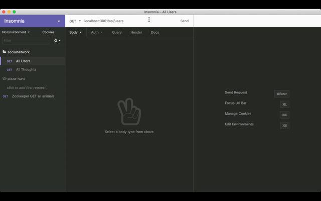
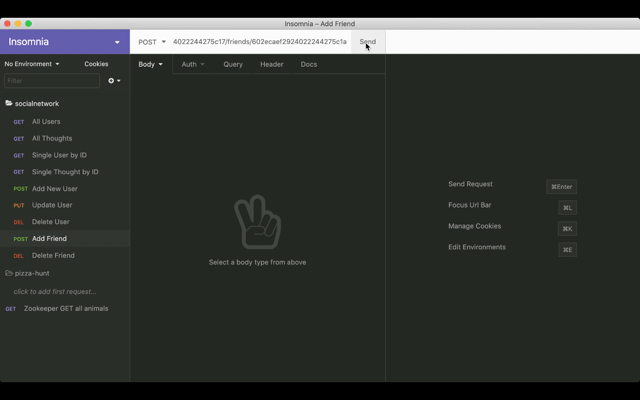

# Social Network

## Description

This is a social networking application that allows users to add friends and share their thoughts. Mongoose, Express and Moment were used to develop this project.

## Installation

Make sure dependencies are installed

On the command line, run:

`npm start`

## Demo

GET routes to return all users and all thoughts

https://drive.google.com/file/d/1LmEZbtCus5EefFewBdFpKN5NwiRWuYKi/view

GET routes to return a single user and a single thought

https://drive.google.com/file/d/1PAQOmeJ6GXiq7w6w4nBXG3J_6aehv48Q/view

POST, PUT and DELETE routes for users

https://drive.google.com/file/d/1WS0ozMkcR6uAfnhFCBdEfuWEnHztbFdJ/view

POST and DELETE routes for a user's friend list

https://drive.google.com/file/d/1dyjBwlAmLz6Qg4A4mU8iUYp04YT1LTGo/view
